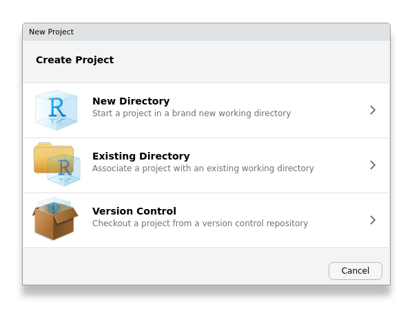
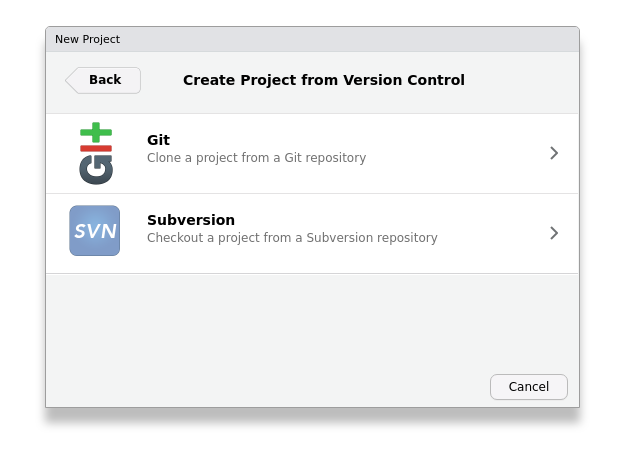
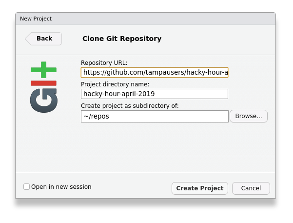

# Hacky Hour with Tampa R Users Group

<a href="https://tampausers.github.io"></a>

### _April 2019_

## Hacky Hour: #TidyTuesday

Join us for an hour (or two) of shared, group hacking on the weekly Twitter phenomenon: [#TidyTuesday][tidytuesday].

Each week, the [&commat;R4DScommunity][r4dscommunity] releases a new data set and data scientists across the globe practice wrangling, visualizing, and modeling data, sharing their results with the community using the [#tidytuesday][tt-twitter] hashtag.

At this week's [Tampa R Users Group Meetup][trug-meetup], we'll work together in small groups or individually to create and share interesting visualizations using the [TidyTuesday Anime dataset][tt-anime] released on 2019-04-23.

## Meetup Info

&#x1F4CD; Southern Brewing & Winemaking  
&#x1F5FA; [4500 North Nebraska Avenue, Tampa](https://maps.google.com/?ll=27.9862041473389,-82.4514465332031)  
&#x2139; <https://www.meetup.com/Tampa-R-Users-Group/events/260640070/>

### What to bring?

- &#x1F913; Your inquisitive self
- &#x1F4BB; A laptop
- &#x1F4BE; The data (see below)
- &#x1F4E6; The [tidyverse](https://tidyverse.org).

  ```r
  install.packages("tidyverse")
  ```
  
<p align="middle"></p>

## Download the data before the meetup

The data set is about 95mb, so make sure you download the data before the meetup -- our meetup venue does have WiFi but it will definitely be easier to download in advance.

The [TidyTuesday Anime dataset][tt-anime] is hosted on the [R4DScommunity GitHub page][tidytuesday]. You can download it from there or use our ready-made RStudio project.

### Use our ready-made RStudio project

If you'd like to have a ready-to-go RStudio project, you can create a new project from this repo. In RStudio, click **File** > **New Project...** and select __Version Control__. Then select __Git__ and in the final screen enter the URL 

```
https://github.com/tampausers/hacky-hour-april-2019
``` 

and choose where you would like to save the project.


<p align="middle">

</p>

### Get the data from r4dscommunity/tidytuesday

You can download the data directly from the [R4DScommunity GitHub page][tt-anime]:

```r
tidy_anime <- readr::read_csv("https://raw.githubusercontent.com/rfordatascience/tidytuesday/master/data/2019/2019-04-23/tidy_anime.csv")
```

## About The Data

The of the following information is copied from the [R4DScommunity GitHub page][tt-anime], feel free to go there to get more information.

### Anime Dataset

This week's data comes from [Tam Nguyen](https://github.com/tamdrashtri) and [MyAnimeList.net via Kaggle](https://www.kaggle.com/aludosan/myanimelist-anime-dataset-as-20190204). [According to Wikipedia](https://en.wikipedia.org/wiki/MyAnimeList) - "MyAnimeList, often abbreviated as MAL, is an anime and manga social networking and social cataloging application website. The site provides its users with a list-like system to organize and score anime and manga. It facilitates finding users who share similar tastes and provides a large database on anime and manga. The site claims to have 4.4 million anime and 775,000 manga entries. In 2015, the site received 120 million visitors a month."

Anime without rankings or popularity scores were excluded. Producers, genre, and studio were converted from lists to tidy observations, so there will be repetitions of shows with multiple producers, genres, etc. The raw data is also uploaded.

Lots of interesting ways to explore the data this week!

### Data Dictionary

Heads up the dataset is about 97 mb - if you want to free up some space, drop the synopsis and background, they are long strings, or broadcast, premiered, related as they are redundant or less useful.

|variable       |class     |description |
|:--------------|:---------|:-----------|
|animeID        |double    | Anime ID (as in https://myanimelist.net/anime/animeID)          |
|name           |character |anime title - extracted from the site.           |
|title_english  |character | title in English (sometimes is different, sometimes is missing)          |
|title_japanese |character | title in Japanese (if Anime is Chinese or Korean, the title, if available, in the respective language)          |
|title_synonyms |character | other variants of the title         |
|type           |character | anime type (e.g. TV, Movie, OVA)          |
|source         |character | source of anime (i.e original, manga, game, music, visual novel etc.)         |
|producers      |character | producers          |
|genre          |character | genre         |
|studio         |character | studio           |
|episodes       |double    | number of episodes           |
|status         |character | Aired or not aired      |
|airing         |logical   | True/False is still airing          |
|start_date     |double    | Start date (ymd)        |
|end_date       |double    | End date (ymd)        |
|duration       |character | Per episode duration or entire duration, text string        |
|rating         |character | Age rating         |
|score          |double    | Score (higher = better)       |
|scored_by      |double    | Number of users that scored          |
|rank           |double    | Rank - weight according to MyAnimeList formula          |
|popularity     |double    |  based on how many members/users have the respective anime in their list          |
|members        |double    | number members that added this anime in their list         |
|favorites      |double    | number members that favorites these in their list          |
|synopsis       |character | long string with anime synopsis          |
|background     |character | long string with production background and other things          |
|premiered      |character | anime premiered on season/year          |
|broadcast      |character | when is (regularly) broadcasted         |
|related        |character | dictionary: related animes, series, games etc.         |


[trug-meetup]: https://www.meetup.com/Tampa-R-Users-Group/events/260640070/
[trug]: https://tampausers.github.io
[tidytuesday]: https://github.com/rfordatascience/tidytuesday
[tt-twitter]: https://twitter.com/search?q=%23tidytuesday
[tt-anime]: https://github.com/rfordatascience/tidytuesday/blob/master/data/2019/2019-04-23
[r4dscommunity]: https://twitter.com/R4DScommunity
